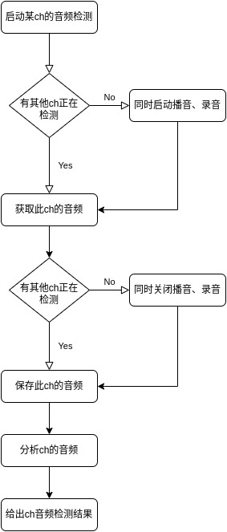

## 音频检测功能需求
- 播放固定1khz音频
- 录音
- 获取自己channel的录音数据（录音分路选择）
- 分析音频
- 录音音频保存

## 需求分析
- 所有通道共用一个播放
- 所有通道共用一个录音（一次录音有8路音频）
- 每个通道需要获取自己的录音数据、存储起来，分析音频，并给出音频分析结果

## 需求实现流程


## 功能接口
```c++

#define AUDIO_TEST_MAX_CHANNEL (8)

typedef enum {
    AUDIO_TEST_IDLE;
    AUDIO_TEST_BUSY;
}audio_test_status_e;

typedef struct {
    uint8_t *data;
    int len;
}audio_data_t;

class Audio_test {

private:
    int audio_test_index;   // 正在检测通道的总数量
    audio_test_status_e status[AUDIO_TEST_MAX_CHANNEL]; // 每个通道的数量
    audio_data_t data[AUDIO_TEST_MAX_CHANNEL];  // 存储每个通道的录音数据指针和长度

public:
    Audio_test();   // 初始化
    ~Audio_test();  // 逆初始化

    void get_record_data_start(int ch, uint8_t *data, int len); // 开始获取通道ch的音频数据
    void get_record_data_stop(int ch);  // 停止获取通道ch的音频数据

    int analyze_audio_data(uint8_t *data, int len); // 分析录音数据
    void save_audio_data(int ch, uint8_t *data, int len); // 保存通道ch的音频数据

};
```

## 功能接口实现
```c++

Audio_test::Audio_test()
{
    audio_test_index = 0;
    for(int i = 0; i < AUDIO_TEST_MAX_CHANNEL; i++){
        status[i] = AUDIO_TEST_IDLE;
        data[i].data = NULL;
        data[i].len = 0;
    }
}

Audio_test::~audio_test()
{

}

void Audio_test::get_record_data_start(int ch, uint8_t *data, int len)
{
    if(ch >= 8 || ch < 0){
        return;
    }

    if(audio_test_index == 0){
        start_play();
        start_record();
    }

    status[ch] = AUDIO_TEST_BUSY;
    data[ch].data = data;
    data[ch].len = len;
    audio_test_index++;
}

void Audio_test::get_record_data_stop(int ch)
{
    if(ch >= 8 || ch < 0){
        return;
    }

    if(--audio_test_index > 0){
        return;
    }else{
        stop_play();
        stop_record();
    }

    // memcpy(data[ch].data, , data[ch].data);

    status[ch] = AUDIO_TEST_IDLE;
}

int Audio_test::analyze_audio_data(uint8_t *data, int len)
{
    // analyze audio data
}


void Audio_test::save_audio_data(int ch, uint8_t *data, int len)
{

}

```
## 具体实现细节
* 驱动层实现： 
    - 适配ADC的ES7210驱动、
    - 修改设备树、
    - 跑通8ch的录音、播音
* 应用层实现： 
    - 实现持续播音、控制
    - 实现持续录音、控制
    - 实现录音音频各个channel数据的分发
    - 实现每个channel数据的保存
    - 分析每个ch的音频，并给出结果
    - 实现语言
        - python实现？
        - c实现？
        - c++实现？